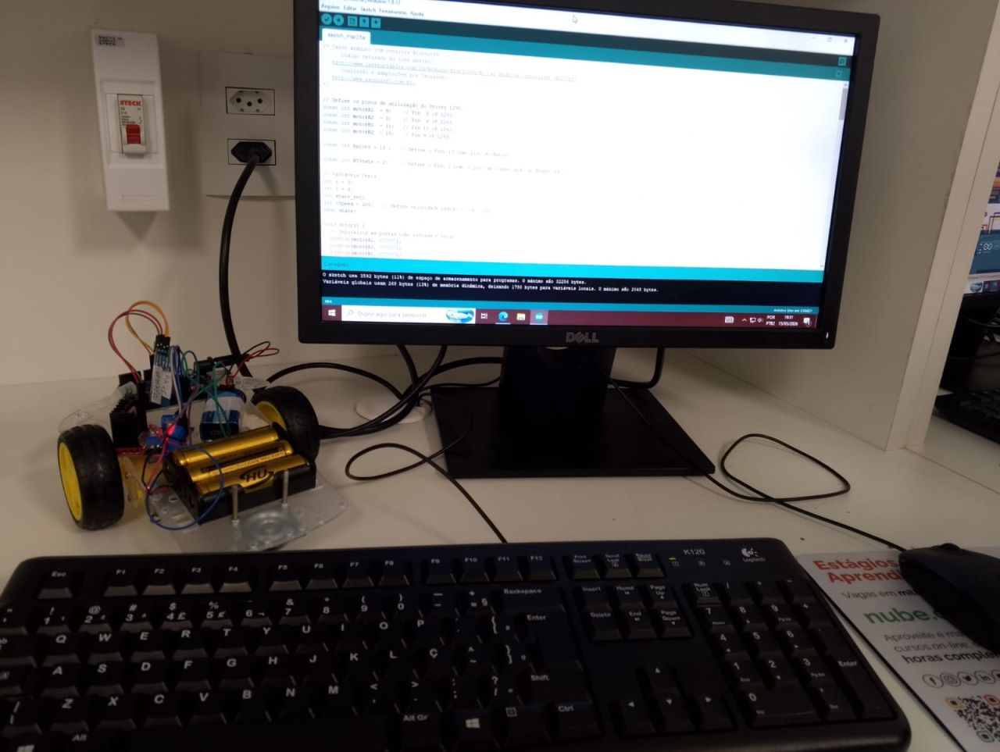
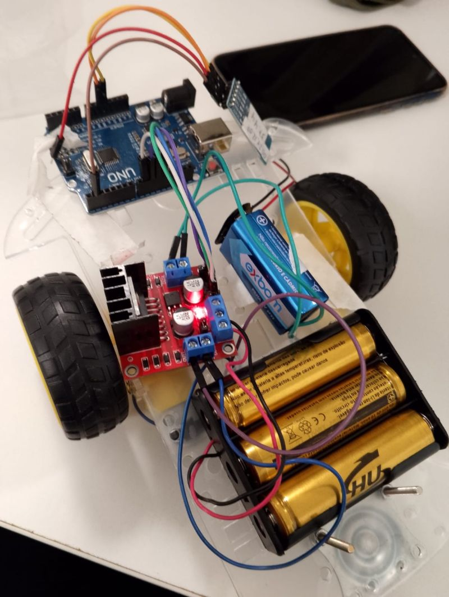

# IoT: Carrinho movido a Bluetooth

## Sobre o Projeto
Este projeto prático foi desenvolvido em equipe durante o primeiro semestre de **Ciência da Computação na FMU**. O objetivo principal foi integrar conceitos de hardware e software, estabelecendo uma comunicação remota e confiável entre um dispositivo mobile e um microcontrolador através do protocolo **Bluetooth**.   
Confira o carrinho em movimento no meu portfólio: https://mttsdev.github.io/Portfolio  

      
    

 
A teoria se consolida quando o hardware responde na prática! Este laboratório permitiu entender de perto o fluxo de dados brutos sem fio e a eletrônica básica que move os dispositivos IoT do mundo real.

---

## Especificações Técnicas

O hardware foi montado do zero em bancada de laboratório, utilizando os seguintes componentes:

| Componente | Função no Projeto |
| :--- | :--- |
| **Arduino Uno R3** | Microcontrolador principal responsável pelo processamento lógico do sketch em C/C++. |
| **Módulo Bluetooth HC-05** | Responsável por receber os comandos seriais enviados pelo aplicativo móvel. |
| **Driver Ponte H L298N** | Módulo de potência que controla o sentido e a velocidade dos motores DC. |
| **Motores DC com Rodas** | Atuadores mecânicos responsáveis pela tração e movimentação do chassi. |
| **Alimentação** | Packs de pilhas e baterias dedicados para separar a energia lógica da tração dos motores. |

> **Nota de Desenvolvimento:** O firmware foi desenvolvido utilizando a **Arduino IDE**, adaptando e otimizando uma base de código em C para a arquitetura física do nosso chassi.

---

## Perspectiva de Segurança

Muito além da robótica, a construção deste ecossistema abriu portas para uma análise crítica sob a ótica de **Defesa Cibernética**:

* **Tráfego em Texto Claro:** A comunicação padrão via Bluetooth ocorre sem criptografia nativa. Isso significa que os comandos de movimentação trafegam expostos, permitindo estudos práticos de interceptação de sinal.
* **Vulnerabilidades em IoT:** Dispositivos inteligentes frequentemente sofrem com a falta de autenticação robusta, tornando-os alvos fáceis para ataques de *replay* ou sequestro de sessão (*hijacking*).

---

## Aprendizados e Desafios

> "Passar 3 horas seguidas na montagem física de um hardware me mostrou que a engenharia vai muito além das linhas de código."

O maior desafio deste projeto não residiu na lógica do código adaptado, mas sim no *troubleshooting* da estrutura física. Identificar o porquê de o módulo receber o sinal perfeitamente (LEDs indicativos ativos) mas os motores não responderem exigiu análise sistemática de continuidade, tensão de alimentação e isolamento de terras comuns. 

Essa mesma persistência investigativa utilizada para caçar um defeito físico em bancada é a competência analítica que levo para o dia a dia na **triagem de alertas e análise de logs de segurança em um SOC**.
